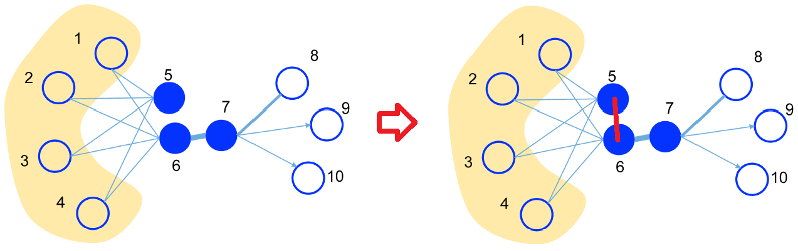

# TensorFlow-GAE-Tutorial
这是一个手把手教你用Tensorflow构建图自编码器（GAE）进行链接预测的教程。
完整代码可在Github中下载：[https://github.com/CrawlScript/TensorFlow-GAE-Tutorial](https://github.com/CrawlScript/TensorFlow-GAE-Tutorial)。

## GAE简介

图自编码器（Graph AutoEncoder，GAE）可以无监督地为输入的图（网络）学习特征，并还原图的拓扑结构。例如GAE可以：
+ 用于推荐系统等，直接预测隐藏的关系（例如利用图的重构结果推测具有相同兴趣的用户）
+ 学习节点表示，将其应用于高层引用（如用户分类、文献分类等）

引用论文《LINE: Large-scale Information Network Embedding》中的一张图为例，假设下图是一个好友网络，可以看出，
用户5和用户6有很大的相似性（共享了很多好友），但是目前他们并不是好友。
使用图自编码器的复原结果（右图），我们可以获取他们之间隐含的相似关系（红色的边）：



与DeepWalk、LINE等基于采样的网络表示学习方法不同，GAE使用端到端的图神经网络来学习节点表示，并可以充分利用节点的特征信息。

在训练GAE时，我们一般会砍掉输入图中的一部分边，并希望GAE能够重构出完整的图。
在线上应用中，我们输入采集到的完整的图，希望它能够预测出许多隐藏的关系。
例如我们可以通过GAE来连接那些潜在的具有相同兴趣的用户。


教程中的完整代码的链接：
+ demo_gae.py: [https://github.com/CrawlScript/tf_geometric/blob/master/demo/demo_gae.py](https://github.com/CrawlScript/tf_geometric/blob/master/demo/demo_gae.py)

有兴趣的可以参考论文《Variational Graph Auto-Encoders》（原文提出的是VGAE，为了简化教程，本教程只介绍其简化版GAE）：
+ 论文地址：[https://arxiv.org/abs/1611.07308](https://arxiv.org/abs/1611.07308)


## 教程概述

+ 图数据简介：介绍图数据集Cora，以及链接预测任务中训练测试数据分离的方法。
+ GAE训练：利用GAE修复破损的Cora数据集，并使用AUC指标对GAE的性能进行评价。

## 开发环境

+ 操作系统: Windows / Linux / Mac OS
+ Python 版本: >= 3.5
+ 依赖包:
    + tf_geometric

根据你的环境（是否已安装TensorFlow、是否需要GPU）从下面选择一条安装命令即可一键安装所有Python依赖:
```bash
pip install -U tf_geometric # 这会使用你自带的TensorFlow，注意你需要tensorflow/tensorflow-gpu >= 1.14.0 or >= 2.0.0b1

pip install -U tf_geometric[tf1-cpu] # 这会自动安装TensorFlow 1.x CPU版

pip install -U tf_geometric[tf1-gpu] # 这会自动安装TensorFlow 1.x GPU版

pip install -U tf_geometric[tf2-cpu] # 这会自动安装TensorFlow 2.x CPU版

pip install -U tf_geometric[tf2-gpu] # 这会自动安装TensorFlow 2.x GPU版
```

教程使用的核心库是tf_geometric，一个基于TensorFlow的GNN库。tf_geometric的详细教程可以在其Github主页上查询：
+ [https://github.com/CrawlScript/tf_geometric](https://github.com/CrawlScript/tf_geometric)


## 导入相关库

本教程使用的核心库是[tf_geometric](https://github.com/CrawlScript/tf_geometric)，我们用它来进行图数据导入、图数据预处理及图神经网络构建，
另外我们还用了tf.keras中的Dropout层和sklearn中的AUC评价指标：

```python
import os
os.environ["CUDA_VISIBLE_DEVICES"] = "0" # 设置使用GPU 0

import tf_geometric as tfg
import tensorflow as tf
from tensorflow import keras
from tf_geometric.utils.graph_utils import edge_train_test_split, negative_sampling
import numpy as np
from sklearn.metrics import roc_auc_score
```

## 数据集介绍和准备

该教程使用了[tf_geometric](https://github.com/CrawlScript/tf_geometric)自带的Cora数据集，你也可以利用tf_geometric轻松地构建自己的数据集。
tf_geometric提供了非常简单的图数据构建接口，只需要传入简单的Python数组或Numpy数组作为节点特征和邻接表即可。

使用自带Cora数据集的方法：
```python
graph, (train_index, valid_index, test_index) = tfg.datasets.CoraDataset().load_data()
```

这里要注意，返回的`(train_index, valid_index, test_index)`是节点级的信息，用于常见的节点分类任务。
在本教程中，我们要自己从graph中将边数据进行训练测试分离，而不会使用`(train_index, valid_index, test_index)`。


自己构建数据集的方法：
```python
graph = tfg.Graph(
    x=np.random.randn(5, 20),  # 5 nodes, 20 features,
    edge_index=[[0, 0, 1, 3],
                [1, 2, 2, 1]]  # 4 undirected edges
)
```

注意，建议使用真实数据训练GAE，而不是完全模拟的数据，因为你自己随机出来的边可能并不能反映节点的语义关系，最后训练出来的GAE只会无脑拟合输入数据。

Cora数据集包含2708个文献作为节点和5429个文献引用信息作为边，其中每个文献都包含文本描述作为节点特征，用Bag-of-words（BOW）的形式构建节点特征向量：
```python
print(graph.x) # 矩阵，包含所有节点的BOW特征
print(graph.edge_index) # 矩阵，包含所有的边信息
```

训练测试分离是链接预测任务中较为繁琐的步骤之一，因为对于无向数据集（我们不关心文献引用的方向），如果将边(a,b)划分到了训练集中，就不应该把边(b,a)划分到测试集。
普通的GAE并不区分(a,b)和(b,a)，会将他们视为同一个样本（边）。如果无脑进行随机划分，出现大量的边(a,b)和边(b,a)分别出现在训练集和训练集的情况，
我们会发现测试阶段的AUC值很高，但这是错误的，因为你在训练过程中训练了测试集的边。

[tf_geometric](https://github.com/CrawlScript/tf_geometric)中提供了正确的边级别训练测试分离方法，即只考虑右上三角的邻接矩阵，
这样数据集中的每种边就唯一了，例如边(5, 12)和(12, 5)都会被表示为(5, 12)。
在右上三角邻接矩阵中进行边的训练测试集划分，我们得到许多无向的边，
再通过Graph对象的convert_edge_to_directed方法将其转换为有向边（恢复左下三角邻接矩阵）即可。

这里尤其要注意，在测试时，我们将真实存在的边看成正样本。但光有正样本是不能够计算AUC指标的，我们还需要负样本（不存在的边）。
这里我们并没有使用所有不存在的边作为负样本，而是使用了负采样（Negative Sampling）技术采样了一部分负样本。
tf_geometric自带了方便的负采样方法`negative_sampling`，在使用它生成测试样本时需要注意，我们应该传入参数`replace=False`,
这样它就不会采样出重复的负样本了。

```python
# 如上所述，训练测试分离时，我们将边转换为无向边
undirected_train_edge_index, undirected_test_edge_index, _, _ = edge_train_test_split(
    edge_index=graph.edge_index,
    num_nodes=graph.num_nodes,
    test_size=0.15
)

# 通过replace=False的负采样，来为测试（评价）产生负样本
undirected_test_neg_edge_index = negative_sampling(
    num_samples=undirected_test_edge_index.shape[1],
    num_nodes=graph.num_nodes,
    edge_index=graph.edge_index,
    replace=False
)

# for training, you should convert undirected edges to directed edges for correct GCN propagation
train_graph = tfg.Graph(x=graph.x, edge_index=undirected_train_edge_index).convert_edge_to_directed()
```

## 基于图卷积网络（GCN）的编码器

原始的图自编码器使用图卷积网络（GCN），基于节点的特征和边，为节点学习高阶特征。
这里我们使用2层GCN来进行编码，并加入了Dropout层来防止过拟合。

这里要注意，我们在使用GCN进行前向传播时，加入了参数`cache=graph.cache`，这是tf_geometric为GCN定制的一个巧妙的缓存策略。
我们知道GCN需要基于邻接矩阵计算一个复杂的变换矩阵，然而这个矩阵之和邻接矩阵相关，并不会在训练过程中变化，可以使用缓存机制来避免重复计算。
另外，由于一个GCN层可能会被用于不同的图，所以并没有把缓存与GCN层绑定，而是允许我们手动传入一个缓存字典。
大部分情况下，这个变换矩阵都是与某个Graph对象绑定的，因此我们直接传入`graph.cache`（图对象自带缓存）作为缓存最为合理。

另外，因为Dropout层需要知道当前的状态（训练还是预测）来决定是否需要执行Dropout操作，我们为编码器方法预留了`training`参数。

编码器代码如下：
```python
embedding_size = 16
drop_rate = 0.2

gcn0 = tfg.layers.GCN(32, activation=tf.nn.relu)
gcn1 = tfg.layers.GCN(embedding_size)
dropout = keras.layers.Dropout(drop_rate)


def encode(graph, training=False):
    h = gcn0([graph.x, graph.edge_index, graph.edge_weight], cache=graph.cache)
    h = dropout(h, training=training)
    h = gcn1([h, graph.edge_index, graph.edge_weight], cache=graph.cache)
    return h
```


## 基于点积的解码器和损失函数

与普通的自编码器不同，图自编码器一般只考虑复原图的结构（即边信息），而不考虑复原节点的特征。
一般情况下，我们使用编码后节点特征点积的Sigmoid激活值来预测边（当成二分类）。
在训练时，一般Sigmoid激活被放在损失函数中，因此我们不需要对点积结果进行激活。

下面代码中，`tf.gather`方法可能大家并不常用，`tf.gather(matrix, [2, 4, 5])`表示取矩阵`matrix`的第2、4、5行堆叠成新的矩阵。

```python
def predict_edge(embedded, edge_index):
    row, col = edge_index
    embedded_row = tf.gather(embedded, row)
    embedded_col = tf.gather(embedded, col)

    # dot product
    logits = tf.reduce_sum(embedded_row * embedded_col, axis=-1)
    return logits
```

如上所述，我们将利用解码器进行边的复原看成是二分类问题，因此使用交叉熵损失函数即可。
这里`pos_edge_logits`是对真实边的预测结果，`neg_edge_logits`是对不存在的边的预测结果。
计算损失函数时，我们不需要使用所有的数据，因为当图较大时，不能存在的边可能会非常多。
因此，一般我们通过负采样（Negative Sampling）来构建`neg_edge_logits`。

```python
def compute_loss(pos_edge_logits, neg_edge_logits):
    pos_losses = tf.nn.sigmoid_cross_entropy_with_logits(
        logits=pos_edge_logits,
        labels=tf.ones_like(pos_edge_logits)
    )

    neg_losses = tf.nn.sigmoid_cross_entropy_with_logits(
        logits=neg_edge_logits,
        labels=tf.zeros_like(neg_edge_logits)
    )

    return tf.reduce_mean(pos_losses) + tf.reduce_mean(neg_losses)
```


## 评价指标

我们使用AUC Score来评价GAE的性能（链接预测的性能），通过将不完整的图输入GAE，
手动使用`tf.nn.sigmoid`对解码结果进行激活作为复原结果。
用sklearn的roc_auc_score方法，输入复原结果和完整的图结构进行计算，得到AUC Score。

```python
def evaluate():
    embedded = encode(train_graph)

    pos_edge_logits = predict_edge(embedded, undirected_test_edge_index)
    neg_edge_logits = predict_edge(embedded, undirected_test_neg_edge_index)

    pos_edge_scores = tf.nn.sigmoid(pos_edge_logits).numpy()
    neg_edge_scores = tf.nn.sigmoid(neg_edge_logits).numpy()

    y_true = np.concatenate([np.ones_like(pos_edge_scores), np.zeros_like(neg_edge_scores)], axis=0)
    y_pred = np.concatenate([pos_edge_scores, neg_edge_scores], axis=0)

    auc_score = roc_auc_score(y_true, y_pred)

    return auc_score
```

## GAE训练

GAE的训练流程与普通的TensorFlow模型训练流程基本一致，定义优化器、计算梯度、应用梯度等。
然而在数据处理上，却有一些需要注意的点。

由于大部分图中包含大量的负样本（不存在的边），我们每次在计算损失时并不会使用所有的负样本，而是通过负采样（Negative Sampling）来采样一定量的负样本。
考虑到效率问题，我们在训练过程中使用tf_geometric自带的负采样方法`negative_sampling`计算损失时，不需要像上面生成测试数据一样设置`replace=False`。
因为在训练时我们可以容忍生成重复的负样本。

下面的代码中，我们每隔20轮就进行一次测试评价。阅读代码的过程中，要细心注意我们什么时候使用的是`train_graph`（破损的图），以及什么时候使用的是`graph`（完整的图）。
在链接预测任务中，这是非常容易混淆的问题。

```python
optimizer = tf.train.AdamOptimizer(learning_rate=1e-2)

for step in range(1000):
    with tf.GradientTape() as tape:
        embedded = encode(train_graph, training=True)

        # negative sampling for training
        train_neg_edge_index = negative_sampling(
            train_graph.num_edges,
            graph.num_nodes,
            edge_index=train_graph.edge_index
        )

        pos_edge_logits = predict_edge(embedded, train_graph.edge_index)
        neg_edge_logits = predict_edge(embedded, train_neg_edge_index)

        loss = compute_loss(pos_edge_logits, neg_edge_logits)

    vars = tape.watched_variables()
    grads = tape.gradient(loss, vars)
    optimizer.apply_gradients(zip(grads, vars))

    if step % 20 == 0:
        auc_score = evaluate()
        print("step = {}\tloss = {}\tauc_score = {}".format(step, loss, auc_score))
```

## 运行结果

```
Downloading data 
  8192/118913 [=>............................] - ETA: 0s
122880/118913 [===============================] - 0s 0us/step
...
step = 0	loss = 1.386212706565857	auc_score = 0.6923464442403837
step = 20	loss = 1.2235560417175293	auc_score = 0.7813233343536373
...
step = 460	loss = 0.8505861759185791	auc_score = 0.9116336980920314
...
```

## 完整代码

教程中的完整代码的链接：
+ demo_gae.py: [https://github.com/CrawlScript/tf_geometric/blob/master/demo/demo_gae.py](https://github.com/CrawlScript/tf_geometric/blob/master/demo/demo_gae.py)
